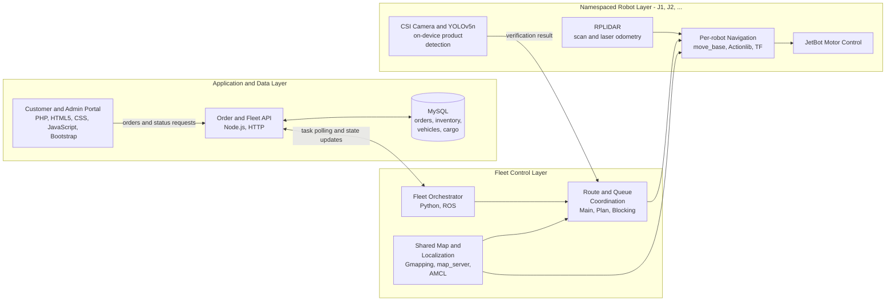

# AIoT Autonomous Fulfillment System

An end-to-end unmanned retail prototype that converts online orders into autonomous, multi-robot product retrieval missions. The system combines a web application, an order and fleet API, a MySQL task database, ROS-based navigation, LiDAR localization, and on-device YOLOv5 object detection on NVIDIA Jetson Nano robots.

The project was designed as a modular AIoT system: customer-facing software manages orders, the backend maintains task and vehicle state, and a ROS fleet controller coordinates robots that navigate to shelves, verify products, and deliver them to collection stations.

> **Repository scope:** The architecture below reflects the complete system documented in the project report. This repository snapshot contains the ROS navigation and fleet-control code, Node.js/MySQL integration, map assets, LiDAR packages, and Jetson-compatible YOLOv5 runtime. The PHP web portal and the report's standalone blocking coordinator are not included here.

## System Architecture



### Order-to-robot data flow

1. The web layer submits an order to the Node.js API, which records each product line as a task in MySQL.
2. The ROS orchestrator polls for pending work, selects idle robots according to capacity and role, and reserves the task.
3. The planner converts shelf and collection-station locations into ordered `move_base` goals. Separate ROS namespaces and TF trees isolate each robot's topics, frames, localization, and navigation state.
4. RPLIDAR scans and laser odometry support localization and obstacle-aware global/local planning. A coordination routine controls access to waiting, queueing, and collection zones to prevent fleet conflicts.
5. A Jetson Nano runs YOLOv5 inference from its CSI camera to verify the requested product at the shelf without streaming raw video to the server.
6. Pickup and delivery events update vehicle, cargo, and order state in MySQL, allowing the web layer to report progress to the customer or administrator.

## Technology Stack

| Area | Technologies | Engineering purpose |
| --- | --- | --- |
| Edge computing | NVIDIA Jetson Nano, SparkFun JetBot, CSI camera | Runs robot control and product recognition close to the hardware |
| Robotics middleware | ROS Melodic, `rospy`, Topics, Actionlib, TF, namespaces | Connects sensors, navigation, perception, and multi-robot control as independent nodes |
| Sensing and odometry | RPLIDAR, `rplidar_ros`, `rf2o_laser_odometry` | Publishes laser scans and estimates robot motion from LiDAR data |
| Mapping and localization | Gmapping, `map_server`, AMCL, occupancy-grid maps | Builds a reusable map and localizes each robot in a shared environment |
| Motion planning | `move_base`, global planner, DWA/TEB local planner, costmaps | Generates waypoint routes and reacts to nearby obstacles |
| Computer vision | YOLOv5n, PyTorch, OpenCV, Roboflow | Trains and deploys a lightweight product detector on the Jetson Nano |
| Fleet and integration software | Python, multithreading, HTTP task polling | Assigns tasks, sequences navigation goals, and coordinates multiple robots |
| Backend | Node.js, HTTP API, Express project scaffold | Bridges the web application, database, and ROS control layer |
| Data layer | MySQL, SQL | Tracks order rows, robot availability, in-transit goods, inventory, and collection stations |
| Web application | PHP, HTML5, CSS, JavaScript, jQuery, Bootstrap 5 | Provides responsive customer ordering and role-based administration |

## Engineering Highlights

### Multi-robot coordination

- Uses a ROS multi-machine design with a central controller and per-robot namespaces.
- Maintains independent `map -> robot/odom -> robot/base_link -> robot/scan` transform chains while sharing one global map.
- Splits fleet logic into task intake, per-robot planning, and blocking/queue coordination so robots can retrieve products concurrently while serializing access to constrained zones.
- Models robot availability, capacity, assigned tasks, and carried goods as explicit database state.

### Autonomous navigation

- Generates the environment map from LiDAR and odometry data, then stores it as `.pgm` and `.yaml` assets for repeatable deployment.
- Uses AMCL for localization and `move_base` for action-based navigation through global and local costmaps.
- Keeps planner, recovery, localization, and sensor parameters in ROS launch/YAML files, separating behavior tuning from application logic.

### Edge AI perception

- Builds a six-class product dataset from JetBot CSI-camera images and expands it with blur, noise, saturation, and rotation augmentation.
- Uses YOLOv5n transfer learning to fit the compute constraints of the Jetson Nano platform.
- Performs inference on the robot and returns only the recognition result, reducing network traffic and keeping the perception loop near the camera.

### Backend and state management

- Exposes task lifecycle operations such as `addTask`, `takeTask`, `taskDecided`, `startTransferring`, and `transferArrive` through an HTTP interface.
- Separates pending order rows, active transfers, robot status, and onboard cargo into dedicated MySQL tables.
- Connects asynchronous web requests with physical robot events, demonstrating full-stack state transitions across software and hardware boundaries.

## Project Results

- Validated navigation and delivery behavior in a 4.8 m x 3.6 m mock supermarket with shelves, waiting/queue zones, and three collection stations.
- Demonstrated coordinated product retrieval with a three-JetBot testbed described in the project report.
- The reported YOLOv5n evaluation achieved near-100% accuracy for most of the six trained product classes under the controlled test conditions.
- demo video: [YouTube demo video](https://www.youtube.com/watch?v=z7E2M3_z6do)

## Repository Map

```text
AIOT_Project/
|-- jetbot_nav/navstack/
|   |-- src/                   # Fleet scheduling, waypoint planning, camera, and motor nodes
|   |-- launch/                # LiDAR, odometry, localization, and multi-robot navigation
|   `-- param/                 # AMCL, costmap, global planner, and local planner tuning
|-- nodejjs/                   # Node.js order and fleet API
|-- rplidar_ros/               # RPLIDAR ROS driver integration
|-- rf2o_laser_odometry/       # LiDAR-based odometry package
|-- yolov5-python3.6.9-jetson/ # Jetson-compatible YOLOv5 runtime
|-- AIOT_DB.sql                # Robot and order-state database schema
|-- project.pgm
`-- project.yaml               # Saved occupancy-grid map
```
